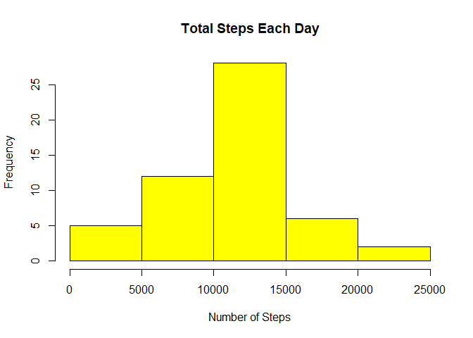

## Loading and preprocessing the data

```r
Sys.setlocale("LC_TIME", "English")
```

```
## [1] "English_United States.1252"
```

```r
df <- read.csv("./activity.csv")
```


## What is mean total number of steps taken per day?


```r
totalStepsByDate <- aggregate(steps ~ date, df, sum)
hist(totalStepsByDate$steps, main = paste("Total Steps Each Day"), col="yellow", xlab="Number of Steps")
```

<!-- -->

```r
dailyMean <- mean(totalStepsByDate$steps)
print(paste("Daily Mean",dailyMean))
```

```
## [1] "Daily Mean 10766.1886792453"
```


```r
dailyMedian <- median(totalStepsByDate$steps)
print(paste("Daily Median",dailyMedian))
```

```
## [1] "Daily Median 10765"
```

## What is the average daily activity pattern?

```r
stepsByInterval <- aggregate(steps ~ interval, df, mean)
plot(stepsByInterval$interval,stepsByInterval$steps, type="l", xlab="Daily Interval", ylab="Steps",main="Average Steps / Day / Interval")
```

<!-- -->


```r
max_interval <- stepsByInterval[which.max(stepsByInterval$steps),1]
print(max_interval)
```

```
## [1] 835
```


## Imputing missing values

```r
naCount <- sum(!complete.cases(df))
print(naCount)
```

```
## [1] 2304
```

```r
imputedData <- transform(df, steps = ifelse(is.na(df$steps), stepsByInterval$steps[match(df$interval, stepsByInterval$interval)], df$steps))
imputedData[as.character(imputedData$date) == "2012-10-01", 1] <- 0
imputedStepsByDate <- aggregate(steps ~ date, imputedData, sum)
hist(imputedStepsByDate$steps, main = paste("Total Steps Each Day"), col=rgb(0,1,0), xlab="Number of Steps")
hist(totalStepsByDate$steps, main = paste("Total Steps Each Day"), col=rgb(1,1,0), xlab="Number of Steps", add=TRUE)
legend("topright", c("Imputed", "Original"), col=c("green", "yellow"), lwd=8)
```

<!-- -->

```r
imputedMean <- mean(totalStepsByDate$steps)
print(imputedMean)
```

```
## [1] 10766.19
```

```r
imputedMedian <- median(totalStepsByDate$steps)
print(imputedMedian)
```

```
## [1] 10765
```


## Are there differences in activity patterns between weekdays and weekends?

```r
library(lattice)
imputedData$dayFactor <- as.factor(ifelse(weekdays(as.Date(imputedData$date, "%Y-%m-%d"))=="Saturday" | weekdays(as.Date(imputedData$date, "%Y-%m-%d"))=="Sunday", "weekend", "weekday"))
aggregateImputedData <- aggregate(steps~interval+dayFactor, imputedData, mean)
xyplot(steps~interval|dayFactor,
       data=aggregateImputedData,
       main="Interval Averages, Weekday v. Weekend",
       xlab="Interval",
       layout=c(1,2),
       type="l")
```

<!-- -->
